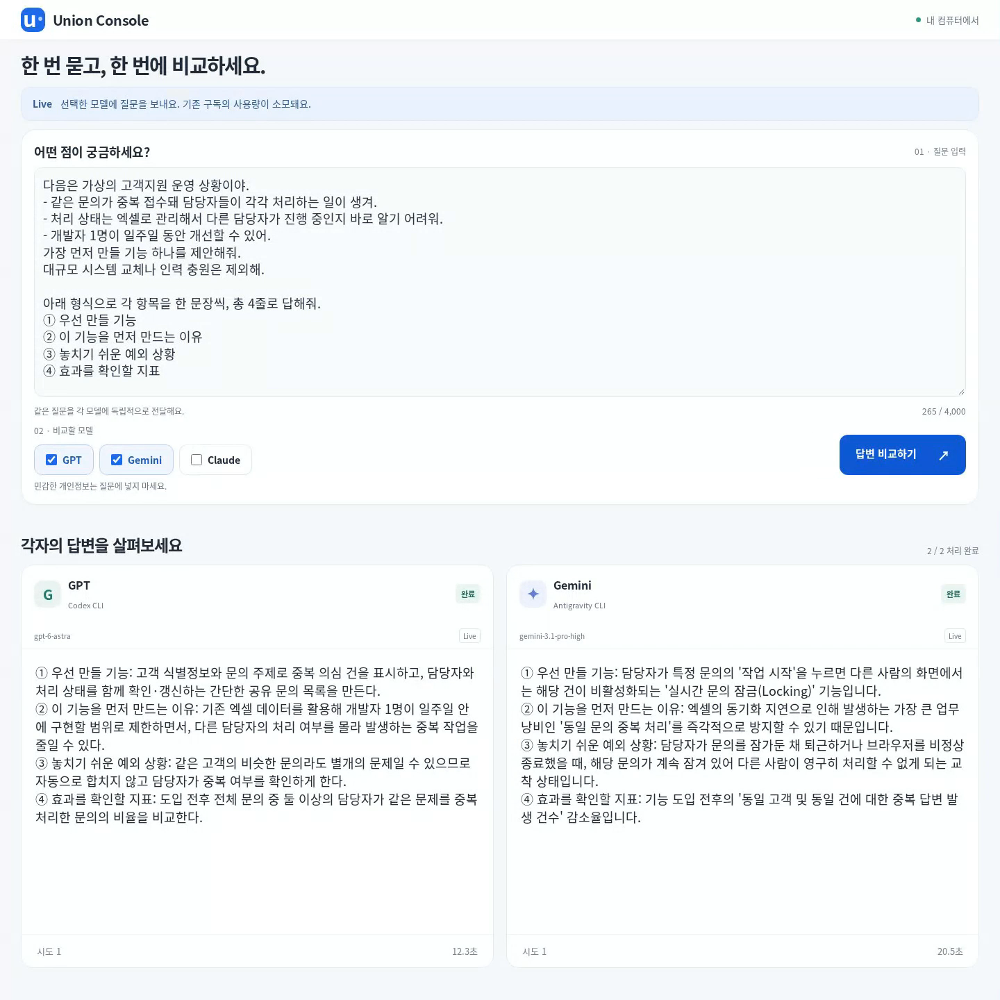

# Union Console

질문을 한 번 입력하고 GPT·Gemini·Claude의 답변을 한 화면에서 비교하는 개인용 로컬 도구입니다. 같은 질문을 반복해서 붙여넣고 여러 창을 오가는 불편에서 시작했습니다.



[35초 시연 영상](docs/media/live-comparison.mp4) · [개발 과정과 역할](docs/CASE_STUDY.md) · [검증 결과](docs/VALIDATION.md)

영상은 가상의 고객지원 상황을 GPT와 Gemini에 질문한 실제 실행 결과입니다.

## Why

같은 질문을 여러 서비스에 붙여넣고 창을 옮겨 다니며 답변을 비교하는 일이 번거로웠습니다. 질문 입력과 결과 확인을 한 화면에 모으고, 실패한 요청만 다시 실행할 수 있게 했습니다.

이미 이용 중인 구독을 활용하기 위해 별도 유료 API를 직접 연동하지 않고 공식 CLI를 연결했습니다. 기존 구독의 사용량 한도 안에서 호출하므로, 이 도구를 위해 API 사용료를 따로 추가하지 않는 선택이었습니다.

개인용 MVP로 질문 전달·상태 표시·답변 비교·개별 재시도까지만 구현했습니다. 대화 이력 저장과 자동 답변 평가는 포함하지 않았습니다.

## Features

- GPT·Gemini·Claude 중 선택한 모델에 같은 질문 전달
- 모델별 답변과 대기·실행 중·완료·실패·시간 초과 상태 표시
- 실패하거나 시간이 초과된 요청만 재시도하고, 완료된 다른 답변은 유지
- 데스크톱에서는 나란히 비교하고 모바일에서는 세로로 확인

개발 환경에서 세 모델의 실제 응답을 확인했습니다. 오류와 재시도 흐름은 Demo와 자동 테스트로 검증했습니다.

## How it works

```text
React / TypeScript
        ↓ 요청 · 상태 조회
     FastAPI
        ↓ 모델별 실행
Codex CLI → GPT
Antigravity CLI → Gemini / Claude
```

| 기술 | 용도 |
|---|---|
| React · TypeScript · Vite | 질문 입력과 답변 비교 화면 |
| Python · FastAPI | 모델별 실행 상태·결과·재시도 관리 |
| Codex CLI · Antigravity CLI | 기존 구독과 인증으로 LLM 호출 |
| pytest · Playwright | 백엔드·브라우저 동작 검증 |

- **실패를 모델별로 처리합니다.** 한 요청이 실패해도 다른 응답은 남고, 재시도 이전의 늦은 결과가 새 결과를 덮어쓰지 않습니다.
- **별도 데이터베이스를 두지 않았습니다.** 화면은 서버 상태를 주기적으로 조회하며, 결과는 메모리에 보관합니다. 서버 종료 시 결과는 사라집니다.

저는 필요한 기능과 범위를 정하고 화면과 재시도 동작을 직접 확인했습니다. 코드·테스트 작성과 실행 검증에는 Codex를 활용했습니다. 선택 이유와 역할은 [Case Study](docs/CASE_STUDY.md)에 정리했습니다.

## Run locally

<details>
<summary>Demo 설치 및 실행</summary>

Linux/WSL, Python 3.12 이상, Node.js 22 이상이 필요합니다. 저장소를 내려받은 뒤 프로젝트 폴더에서 실행합니다.

```bash
python3 -m venv .venv
.venv/bin/python -m pip install -r requirements.txt
npm --prefix frontend ci
npm --prefix frontend run build
bash scripts/start.sh
```

http://127.0.0.1:8000 에서 확인하고, 터미널의 `Ctrl+C`로 종료합니다.

기본값은 로그인 없이 예시 응답을 보여주는 Demo 모드입니다. 실제 모델 연결에는 별도의 CLI 인증과 실행 환경 검증이 필요합니다. 인증 파일이나 API 키를 저장소에 추가하지 마세요.

실패·시간 초과·재시도를 확인하려면 서버 종료 후 실행합니다.

```bash
UNION_DEMO_SCENARIO=recovery bash scripts/start.sh demo 8000
```

</details>
